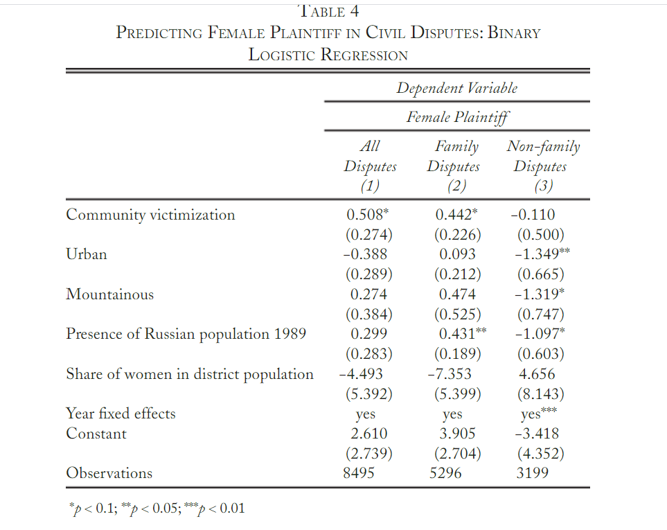

```{r setup, include=FALSE}
knitr::opts_chunk$set(echo = FALSE)
library(tidyverse)
library(stargazer)
library(bookdown)
library(foreign)
library(plyr)
library(dplyr)
library(Hmisc)
library(arm)
library(stargazer)
library(ggthemes)
require(ggplot2)
require(reshape2)
require(devtools)
require(scales)
library(lme4)
library(magrittr)
library(ggthemes)
library(RColorBrewer)
library(multiwayvcov)
library(sandwich)
library(lmtest)
library(ggplot2)
library(interactions)
```

# Paper Overview

This paper [@paper] by Egor Lazarev entitled "Laws In Conflict: Legacies of War, Gender, and Legal Pluralism in Chechnya" examines post-war Chechnya and how legacies of war affect people's choice between various legal processes. In modern-day Chechnya, there are three competing legal bodies: official Russian law, sharia courts [@sharia], and customary law (adat) [@adat]. The author argues that sharia and adat courts are traditionally more discriminatory towards women, and that women are more likely than men to turn to state courts rather than sharia courts or adat. The pattern of women choosing to turn to state courts for legal disputes rather than sharia or customary courts is exacerbated, as the author works to show through data, by the level to which a region was affected by violence during the Chechen wars [@wars]. In other words, conflict provided women with more opportunity to pursue their interests through official law. The author, Egor Lazarev, backs up his claim through data and through a comparison with neighboring Ingushetia, which has many similarities but has not gone through conflict. The enhanced opportunities for women in the legal process has been counterbalanced by an effort by the Ramzan Kadyrov government in Chechnya to retraditionalize the republic [@retraditionalize], and while women continue to look to state courts for assistance, Kadyrov works toward supporting more traditional forms of conflict resolution that favor men and Chechnya's traditionally patriarchal society. The author concludes that gender can play a large role in forming splits in post-conflict societies.^[All analysis for this paper is available under Milestone-3.Rmd in my github repo: https://github.com/dfshapir/Replication]

Lazarev uses data throughout his paper to support his claims. The primary method he uses is ordinary least squares regression, in which Lazarev tests a number of different independent variables, including gender, exposure to conflict, distance from Chechnya’s capital (Groznyy), altitude (given cultural differences between upland and lowland Chechens [@mountain]) and various other variables on three indexes, which he labels indexRL, indexS and indexA. IndexRL, created by Lazarev early in the paper based on interview data, measures a given person’s likelihood to opt for Russian law, which indexS and indexA measure likelihood of sharia and adat, respectively. The author includes a number of graphics as well, including several ggplots, regression tables (created through stargazer) and others. Lazarev uses all of these methods to elucidate patterns in the data and arrive at his previously-described conclusions.

\pagebreak
# Appendix
This appendix first shows my replications of Lazarev's graphs and tables, and then my summary of how replication went at the end, before my extension statement and bibliography. 

In this first graphic, I use Lazarev's data to show gender-based trends in choice of legal structure in Chechnya. Lazarev makes the same graph in his paper; however, I made sure to format mine in a more "beautiful" manner. The graph shows how men and women differ in their respective likelihoods to choose Russian state law, sharia, and adat. The error bars are included as well to show the uncertainty around the means. The graph is labeled in Lazarev's piece as FIGURE 3.

```{r graphic, message = FALSE, warning = FALSE}
# I commented out this whole code in my Milestone-3.Rmd in the Figure 3 section. I made a few changes for the purposes of this assignment, which I have indicated in this code chunk. 

fig3dat <- read.csv2("raw-data/upd_wp_data_survey.csv")

range01 <- function(x) {(x - min(x))/(max(x) - min(x))}

require(plyr)
length2 <- function (x, na.rm=FALSE) {
  if (na.rm) sum(!is.na(x))
  else       length(x)
}

if (!require(pacman)) install.packages("pacman")

pacman::p_load(readr, ggplot2, plyr, dplyr, magrittr, tidyr, purrr, ggthemes)

means1 <- round(tapply(fig3dat$indexRL, fig3dat$female, mean, na.rm = T), digits=3)
sds1 <- round(tapply(fig3dat$indexRL, fig3dat$female, sd, na.rm = T), digits=3)
n1 <- tapply(fig3dat$indexRL, fig3dat$female, length2, na.rm = T)

se1 <- round(sds1/sqrt(n1), digits=3)

error1 <- round((qt(0.975,df=n1-1)*se1), digits = 3)

min <- c(0,1)
object1 <- c(1,1)

means2 <- round(tapply(fig3dat$indexS, fig3dat$female, mean, na.rm = T), digits=3)
sds2 <- round(tapply(fig3dat$indexS, fig3dat$female, sd, na.rm = T), digits=3)
n2 <- tapply(fig3dat$indexS, fig3dat$female, length2, na.rm = T)
se2 <- round(sds2/sqrt(n2), digits=3)
error2 <- round((qt(0.975,df=n2-1)*se2), digits = 3)
object2 <- c(2,2)

means3 <- round(tapply(fig3dat$indexA, fig3dat$female, mean, na.rm = T), digits=3)
sds3 <- round(tapply(fig3dat$indexA, fig3dat$female, sd, na.rm = T), digits=3)
n3 <- tapply(fig3dat$indexA, fig3dat$female, length2, na.rm = T)
se3 <- round(sds3/sqrt(n3), digits=3)
error3 <- round((qt(0.975,df=n3-1)*se3), digits = 3)
object3 <- c(3,3)

V1_dat <- rbind(cbind(object1, min, means1, sds1, n1, se1, error1, deparse.level=0),
                cbind(object2, min, means2, sds2, n2, se2, error2, deparse.level=0),
                cbind(object3, min, means3, sds3, n3, se3, error3, deparse.level=0))

rownames(V1_dat) <- c(1:6) 
colnames(V1_dat) <- c("sum", "min", "put", "sds", "n", "se", "error") 
sb <- as.data.frame(V1_dat)

sb2 <- sb

sb2$min <- as.factor(sb2$min) 
sb2$sum <- as.factor(sb2$sum)
levels(sb2$sum) <- c("State Law", "Sharia", "Adat") 

figure3 <- ggplot(sb2, aes(x=sum, y=put, fill = min)) + 
  geom_bar(position=position_dodge(), 
           stat="identity", size=.3) + 
  geom_errorbar(aes(ymin=put-error, ymax=put+error),
                size=.5,    
                width=.3,
                position=position_dodge(.9)) +
  
# Added titles and axis labels, changed to labs() instead of xlab(), ylab() and ggtitle()
  
  labs(title = "FIGURE 3: How Gender Impacts Choice of Legal System",
       subtitle = "Data From Lazarev, 'Laws in Conflict: Legacies of War, Gender, and Legal Pluralism in Chechnya'",
       x = "Legal System",
       y = "Mean of Index",
       caption = "Data from surveys performed by Lazarev during fieldwork. Indexes are calculated by averaging the number \nof scenarios where participants respond that they would choose one form of law over another.") +
  coord_cartesian(ylim=c(0, .5))+  
  scale_y_continuous(breaks=seq(0, 0.5, .1)) +
  scale_fill_manual(name="Gender", 
                    breaks=c("0", "1"), 
                    labels=c("Male", 
                             "Female"),
                    
# Capitalized legend labels

                    values=c("cornsilk3", "gray33")) +
  theme(text = element_text(size = 10),
        
# Changed text size
        
  axis.line = element_line(colour = "black"),

# Kept axis title

        panel.grid.major = element_blank(),
        panel.grid.minor = element_blank(),
        panel.background = element_blank())

figure3
```
\pagebreak

Labeled as Table 2 in the article. Results aren't quite perfect, but they're very, very close. There are no discrepancies in trends between the replicated table and the table in the data. 

```{r include = FALSE}
upd_data <- read.csv2("raw-data/upd_wp_data_survey.csv")

l1 <- lm(indexRL ~ killed + wounded + damaged + displaced + female + 
           as.factor(age_cohorts) + incomefull + edufull + unemployed + urban_com, data=upd_data) 
summary(l1) 

l2 <- lm(indexS ~ killed + wounded + damaged + displaced + female + 
           as.factor(age_cohorts) + incomefull + edufull + unemployed + urban_com, data=upd_data) 
summary(l2) 

l3 <- lm(indexA ~ killed + wounded + damaged + displaced + female + 
           as.factor(age_cohorts) + incomefull + edufull + unemployed + urban_com, data=upd_data) 
summary(l3) 
```

```{r table2, results = "asis"}
stargazer(l1, l2, l3, title="OLS Regression Analysis of the Impact of Victimization on Legal Preferences", 
          type = "latex",
          header = FALSE)
```

\pagebreak
Labeled as Table 3 in the article.

```{r tab3prep, include = FALSE}
k1 <- lm(indexRL ~ com_exposure*female + 
           as.factor(age_cohorts) + incomefull + edufull + unemployed + urban_com + 
           russ_pop + lmaltitude + ldistance_Grozny + lcom_size + as.factor(rayon), data = upd_data)
summary(k1)

k1_vcov <- cluster.vcov(k1, upd_data$location)

coeftest(k1, vcov. = k1_vcov)

cluster_se <- sqrt(diag(cluster.vcov(k1, upd_data$location)))

k2 <- lm(indexS ~ com_exposure*female + 
           as.factor(age_cohorts) + incomefull + edufull + unemployed + urban_com + 
           russ_pop + lmaltitude + ldistance_Grozny + lcom_size + as.factor(rayon), data = upd_data)
summary(k2)

k2_vcov <- cluster.vcov(k2, upd_data$location)

coeftest(k2, vcov. = k2_vcov)

cluster_se <- sqrt(diag(cluster.vcov(k2, upd_data$location)))

k3 <- lm(indexA ~ com_exposure*female + 
           as.factor(age_cohorts) + incomefull + edufull + unemployed + urban_com + 
           russ_pop + lmaltitude + ldistance_Grozny + lcom_size + as.factor(rayon), data = upd_data)
summary(k3)

k3_vcov <- cluster.vcov(k3, upd_data$location)

coeftest(k3, vcov. = k3_vcov)

cluster_se <- sqrt(diag(cluster.vcov(k2, upd_data$location)))

```

```{r tab3, results = "asis"}

stargazer(k1, k2, k3, se = list(coeftest(k1, vcov. = k1_vcov)[,2],
                                coeftest(k2, vcov. = k2_vcov)[,2],
                                coeftest(k3, vcov. = k3_vcov)[,2]),
          title = "OLS Regression Analysis of the Effect of Community Victimization and Gender on Legal Preferences",
          type = "latex",
          header = FALSE,
          keep = c("\\bcom_exposure\\b", "\\bfemale\\b", "\\bConstant\\b"))

# Formatted to make it look more like his table

```

\pagebreak
Below, I used Lazarev's code to replicate a table from his paper. He labels it originally as Table 3 in his code; in the paper, it is labeled as Table 4.

```{r include = FALSE}
reg_data <- read.csv2("raw-data/wp_data_courts.csv")

# I changed the name of the data from his original. I also put include = FALSE so that this all would not show up in the PDF, but I could make a table out of it. 

famdata <- reg_data[which(reg_data$family==1),]
nonfamdata <- reg_data[which(reg_data$family==0),]

m1 <- glm(istez_females ~ com_exposure + urban +
            mountainous + russ_pop + pop_fem_share + 
            as.factor(year),family=binomial(link='logit'),data = reg_data)
summary(m1)

m1_vcov <- cluster.vcov(m1, reg_data$uchastok)

coeftest(m1, vcov. = m1_vcov)

cluster_se <- sqrt(diag(cluster.vcov(m1, reg_data$uchastok)))

stargazer(m1, se = list(coeftest(m1, vcov. = m1_vcov)[,2]), 
          omit.stat = c("rsq", "f", "adj.rsq", "ser"))

m2 <- glm(istez_females ~ com_exposure + urban +
            mountainous + russ_pop + pop_fem_share + 
            as.factor(year),family=binomial(link='logit'),data=famdata)
summary(m2)

m2_vcov <- cluster.vcov(m2, famdata$uchastok)

coeftest(m2, vcov. = m2_vcov)

cluster_se <- sqrt(diag(cluster.vcov(m2, famdata$uchastok)))

m3 <- glm(istez_females ~ com_exposure + urban +
            mountainous + russ_pop + pop_fem_share + 
            as.factor(year),family=binomial(link='logit'),data=nonfamdata)
summary(m3)

m3_vcov <- cluster.vcov(m3, nonfamdata$uchastok)

coeftest(m3, vcov. = m3_vcov)

cluster_se <- sqrt(diag(cluster.vcov(m3, nonfamdata$uchastok)))
```

```{r tab4, results = "asis"}
stargazer(m1, m2, m3, se = list(coeftest(m1, vcov. = m1_vcov)[,2],
                                coeftest(m2, vcov. = m2_vcov)[,2],
                                coeftest(m3, vcov. = m3_vcov)[,2]),
          title = "Predicting Female Plaintiff in Civil Disputes: Binary Logistic Regression",
          type="latex", 
          header = FALSE)
```

\pagebreak

Above is a screenshot of the actual table in Lazarev's paper. There are some differences in formatting, but all of the numbers that I got match the numbers in the table. Lazarev removes all of the coefficients for individual years and simply puts "yes" for "Year fixed effects" in every column. Also, Lazarev cleans up some of his variable names for purposes of readability. The numbers, however, check out.

```{r image, fig.cap = "Lazarev Image", out.width = '100%'}

```

\pagebreak
These next few pages display a series of graphs which show up as one graphic (Figure 2) in the article. He originally had a nice function that grouped them all together into one graphic, but it didn't work for me. So I just included all the graphs individually -- my apologies. The numbers match those in the article. 
```{r include = FALSE}
# NOTE: Above

# This code was originally here, but the link threw an Error 404, so I'm just putting it in the comments. suppressMessages("https://raw.github.com/gerasy1987/useful_r/master/functions.R" %>% devtools::source_url()). My guess is that this was simply used to make sure that the code ran smoother.

figdat <- read.csv2("raw-data/wp_data_raw.csv")

```


```{r}
h1 <- ggplot(data=figdat[!is.na(figdat$Q1),], 
             aes(factor(Q1))) + 
  geom_bar(aes(y = (..count..)/sum(..count..)),
           fill=("grey69"), position = "dodge") + 
  geom_text(aes(y = ((..count..)/sum(..count..)), 
                label = round((..count..)/sum(..count..), digits = 2)), 
            stat = "count", vjust = -0.25, size = 8) +
  scale_y_continuous(limits=c(0, .8)) +
  scale_x_discrete(labels=c("1" = "State Law","2" = "Sharia","3" = "Adat", "4" = "Don't Know")) +
  labs(title = "Child Custody",
       y = "Share",
       x = "")
h1
```


```{r}
h2 <- ggplot(data=figdat[!is.na(figdat$Q3_graph),], 
             aes(factor(Q3_graph))) + 
  geom_bar(aes(y = (..count..)/sum(..count..)),
           fill=("grey69"), position = "dodge") + 
  geom_text(aes(y = ((..count..)/sum(..count..)), 
                label = round((..count..)/sum(..count..), digits = 2)), 
            stat = "count", vjust = -0.25, size = 8) +
  scale_y_continuous(limits=c(0, .8)) +
  scale_x_discrete(labels=c("1" = "State Law","2" = "Sharia","3" = "Adat", "4" = "Don't Know")) +
  labs(title = "Domestic Violence",
       y = "Share",
       x = "")
h2
```


```{r}
h3 <- ggplot(data=figdat[!is.na(figdat$Q5_graph),], 
             aes(factor(Q5_graph))) + 
  geom_bar(aes(y = (..count..)/sum(..count..)),
           fill=("grey69"), position = "dodge") + 
  geom_text(aes(y = ((..count..)/sum(..count..)), 
                label = round((..count..)/sum(..count..), digits = 2)), 
            stat = "count", vjust = -0.25, size = 8) +
  scale_y_continuous(limits=c(0, .8)) +
  scale_x_discrete(labels=c("1" = "State Law","2" = "Sharia","3" = "Adat", "4" = "Don't Know")) +
  labs(title = "Bride Kidnapping",
       y = "Share",
       x = "")
h3
```


```{r}
h4 <- ggplot(data=figdat[!is.na(figdat$Q8_graph),], 
             aes(factor(Q8_graph))) + 
  geom_bar(aes(y = (..count..)/sum(..count..)),
           fill=("grey69"), position = "dodge") + 
  geom_text(aes(y = ((..count..)/sum(..count..)), 
                label = round((..count..)/sum(..count..), digits = 2)), 
            stat = "count", vjust = -0.25, size = 8) +
  scale_y_continuous(limits=c(0, .8)) +
  scale_x_discrete(labels=c("1" = "State Law","2" = "Sharia","3" = "Adat", "4" = "Don't Know")) +
  labs(title = "Honor Killing",
       y = "Share",
       x = "")
h4
```


```{r}
h5 <- ggplot(data=figdat[!is.na(figdat$Q10),], 
             aes(factor(Q10))) + 
  geom_bar(aes(y = (..count..)/sum(..count..)),
           fill=("grey69"), position = "dodge") + 
  geom_text(aes(y = ((..count..)/sum(..count..)), 
                label = round((..count..)/sum(..count..), digits = 2)), 
            stat = "count", vjust = -0.25, size = 8) +
  scale_y_continuous(limits=c(0, .8)) +
  scale_x_discrete(labels=c("1" = "State Law","2" = "Sharia","3" = "Adat", "4" = "Don't Know")) +
  labs(title = "Polygamy",
       y = "Share",
       x = "")
h5
```


```{r}
h6 <- ggplot(data=figdat[!is.na(figdat$Q12),], 
             aes(factor(Q12))) + 
  geom_bar(aes(y = (..count..)/sum(..count..)),
           fill=("grey69"), position = "dodge") + 
  geom_text(aes(y = ((..count..)/sum(..count..)), 
                label = round((..count..)/sum(..count..), digits = 2)), 
            stat = "count", vjust = -0.25, size = 8) +
  scale_y_continuous(limits=c(0, .8)) +
  scale_x_discrete(labels=c("1" = "State Law","2" = "Sharia","3" = "Adat", "4" = "Don't Know")) +
  labs(title = "Inheritance",
       y = "Share",
       x = "")
h6
```


```{r}
h7 <- ggplot(data=figdat[!is.na(figdat$Q14),], 
             aes(factor(Q14))) + 
  geom_bar(aes(y = (..count..)/sum(..count..)),
           fill=("grey69"), position = "dodge") + 
  geom_text(aes(y = ((..count..)/sum(..count..)), 
                label = round((..count..)/sum(..count..), digits = 2)), 
            stat = "count", vjust = -0.25, size = 8) +
  scale_y_continuous(limits=c(0, .8)) +
  scale_x_discrete(labels=c("1" = "State Law","2" = "Sharia","3" = "Adat", "4" = "Don't Know")) +
  labs(title = "Property",
       y = "Share",
       x = "")
h7
```

```{r}
h8 <- ggplot(data=figdat[!is.na(figdat$Q16),], 
             aes(factor(Q16))) + 
  geom_bar(aes(y = (..count..)/sum(..count..)),
           fill=("grey69"), position = "dodge") + 
  geom_text(aes(y = ((..count..)/sum(..count..)), 
                label = round((..count..)/sum(..count..), digits = 2)), 
            stat = "count", vjust = -0.25, size = 8) +
  scale_y_continuous(limits=c(0, .8)) +
  scale_x_discrete(labels=c("1" = "State Law","2" = "Sharia","3" = "Adat", "4" = "Don't Know")) +
  labs(title = "Car Accident",
       y = "Share",
       x = "")
h8
```

```{r}
h9 <- ggplot(data=figdat[!is.na(figdat$Q18),], 
             aes(factor(Q18))) + 
  geom_bar(aes(y = (..count..)/sum(..count..)),
           fill=("grey69"), position = "dodge") + 
  geom_text(aes(y = ((..count..)/sum(..count..)), 
                label = round((..count..)/sum(..count..), digits = 2)), 
            stat = "count", vjust = -0.25, size = 8) +
  scale_y_continuous(limits=c(0, .8)) +
  scale_x_discrete(labels=c("1" = "State Law","2" = "Sharia","3" = "Adat", "4" = "Don't Know")) +
  labs(title = "Debt",
       y = "Share",
       x = "")
h9
```

```{r murder}
h10 <- ggplot(data=figdat[!is.na(figdat$Q20),], 
              aes(factor(Q20))) + 
  geom_bar(aes(y = (..count..)/sum(..count..)),
           fill=("grey69"), position = "dodge") + 
  geom_text(aes(y = ((..count..)/sum(..count..)), 
                label = round((..count..)/sum(..count..), digits = 2)), 
            stat = "count", vjust = -0.25, size = 8) +
  scale_y_continuous(limits=c(0, .8)) +
  scale_x_discrete(labels=c("1" = "State Law","2" = "Sharia","3" = "Adat", "4" = "Don't Know")) +
  labs(title = "Murder",
       y = "Share",
       x = "")
h10
```

\pagebreak
This next graph is Figure 5, showing differences in victimization and nonvictimization. The graph looks exactly like the one in the paper.

```{r include = FALSE}
fig5data <- read.csv2("raw-data/upd_wp_data_survey.csv")

fig5data$victimized[fig5data$com_exposure=='0']<-'nonvictimized'
fig5data$victimized[fig5data$com_exposure=='1']<-'victimized'

fig5data$gender[fig5data$female=='0']<-'male'
fig5data$gender[fig5data$female=='1']<-'female'

m1 <- lm(indexRL ~ victimized*gender + 
           as.factor(age_cohorts) + incomefull + edufull + unemployed + urban_com +
           russ_pop + lmaltitude + ldistance_Grozny + lcom_size, data = fig5data)
summary(m1)

figure5 <- cat_plot(m1, pred = victimized, modx = gender, geom = "bar") + 
  labs(x="", y = "", title = "Interaction Plot for the Effects of Community Victimization \nand Gender on Support for State Law") +
  scale_color_manual("gender", values=c('grey20','grey60'))+
  scale_fill_manual("gender",values=c('grey30','grey80'))
``` 

```{r}
figure5
```

\pagebreak
The final graph that the author uses is this comparison of how men and women view Russian state law in Chechnya and Ingushetia, comparatively. The replicated graph matches the one in the article. 
```{r}
total <- read.csv2("raw-data/wp_data_Chechnya_Ingushetia.csv")

ftotal <- total[which(total$data.female==1),]
mtotal <- total[which(total$data.female==0),]

means1 <- round(tapply(ftotal$data.indexRL, ftotal$chechnya, mean, na.rm = T), digits=3)
sds1 <- round(tapply(ftotal$data.indexRL, ftotal$chechnya, sd, na.rm = T), digits=3)
n1 <- tapply(ftotal$data.indexRL, ftotal$chechnya, length2, na.rm = T)
se1 <- round(sds1/sqrt(n1), digits=3)
error1 <- round((qt(0.975,df=n1-1)*se1), digits = 3)
min <- c(0,1)
object1 <- c(1,1)

means2 <- round(tapply(mtotal$data.indexRL, mtotal$chechnya, mean, na.rm = T), digits=3)
sds2 <- round(tapply(mtotal$data.indexRL, mtotal$chechnya, sd, na.rm = T), digits=3)
n2 <- tapply(mtotal$data.indexRL, mtotal$chechnya, length2, na.rm = T)
se2 <- round(sds2/sqrt(n2), digits=3)
error2 <- round((qt(0.975,df=n2-1)*se2), digits = 3)
min <- c(0,1)
object2 <- c(2,2)

V1_dat <- rbind(cbind(object1, min, means1, sds1, n1, se1, error1, deparse.level=0),
                cbind(object2, min, means2, sds2, n2, se2, error2, deparse.level=0))

rownames(V1_dat) <- c(1:4) 
colnames(V1_dat) <- c("sum", "min", "put", "sds", "n", "se", "error") 
sb <- as.data.frame(V1_dat)

sb2 <- sb
sb2$min <- as.factor(sb2$min) 
sb2$sum <- as.factor(sb2$sum)
levels(sb2$sum) <- c("Women", "Men") 

figure6 <- ggplot(sb2, aes(x=sum, y=put, fill = min)) + 
  geom_bar(position=position_dodge(), 
           stat="identity", size=.3) +      
  geom_errorbar(aes(ymin=put-error, ymax=put+error),
                size=.5,    # Thinner lines
                width=.3,
                position=position_dodge(.9)) +
  xlab("") +
  ylab("") +
  ggtitle("Gender Gaps in Support for State Law in Chechnya and Ingushetia") +
  coord_cartesian(ylim=c(0, .5))+  
  scale_y_continuous(breaks=seq(0, 0.5, .1)) +
  scale_fill_manual(name="Region", # Legend label, use darker colors
                    # breaks=c("1", "2", "3"),
                    breaks=c("0", "1"), 
                    labels=c("Ingushetia", 
                             "Chechnya"),
                    values=c("gray88", "grey44")) +
  theme(text = element_text(size=10),
        axis.line = element_line(colour = "black"),
        axis.title.x = element_blank(),
        panel.grid.major = element_blank(),
        panel.grid.minor = element_blank(),
        panel.background = element_blank())
figure6
```

### Statement

I was able to replicate all parts of Lazarev's paper. He provided very detailed code that matched almost exactly with the tables and graphs he provided in his paper. This section went quite smoothly. As such, I am focusing my extension (see next page) on critiques of Lazarev's analysis and data choices, not reproducibility.

\pagebreak
# Extension

My extension is split up into two separate critiques: analysis critiques and data critiques. These two categories overlap significantly, but I believe that splitting them up in such a way provides structure to the paper. In general, I believe that Lazarev comes to many convincing conclusions and uses data well to support his findings. Nonetheless, there are a few areas in which I believe that Lazarev could have been more thorough and/or where I believe that literature does not support Lazarev’s findings.

#### Analysis critiques

First of all, I believe that Lazarev oversimplifies sharia’s resurgence and role in Chechnya. He largely seems to place the promotion of sharia in modern-day Chechnya as a patriarchal response to increased women’s empowerment in Chechnya following the wars. While I see where he is coming from, I believe that glosses over some other main reasons behind why Kadyrov started to re-emphasize sharia in the first place, thereby relying on gender as a driver a bit more heavily than necessary. After the Second War and the re-integration of Chechnya, Kadyrov was tasked with putting Chechnya back together. In this process, he had to negotiate with rebel Islamists and cajole them into rejoining society. Lazarev paints Chechnya’s re-Islamicization as a patriarchal reaction to a system in which women had more power in society. While this certainly may have been part of it, I think that the gymnastics necessary to persuade this radicalized portion of Chechnya to return to society was an equally (if not more) important driver. Ramzan’s retraditionalization of societal norms was a key factor in weakening the pull of the radical insurgency: Even if some rebel fighters believed that an independent Chechnya was doomed to fail, they would still support the insurgency because they believed that conservative Islam was right for Chechnya, especially in the face of “godless” Russia, and that a Chechnya within Russia would be forced to submit to Russian authority and potentially even give up its religion, as was the case in the Soviet Union. But by establishing Chechnya as a more conservative Islamic republic and tightening Chechnya’s societal laws, Kadyrov showed radicalized Chechens that it is indeed possible to exist inside Russia and still observe traditional, conservative Islam. For insurgency leaders, this posed a huge problem: how can one propagate an anti-Russia, anti-Kadyrov message when the Kadyrov regime has in fact implemented many of the ideologies that the insurgency wanted? I therefore believe that the switch to promoting a “macho” form of sharia was a strategic decision based not so much on stemming the rise of women into important positions in Chechnya, but on convincing radicalized and overwhelmingly male ex-fighters that insurgency was *not necessary*, because the new Chechnya would be based on a similar moral framework to the one that existed in the insurgency—simply inside Russia instead of outside it. While the data that Lazarev provides definitely supports his argument about the split in gender, I am somewhat worried that the author leans too heavily at times on gender as a driver of policy, especially regarding the re-establishment of sharia.

Secondly, Lazarev writes that “at the macro level, the gender gap in legal preferences is largely driven by men.” A number of questions spring from this statement: Does this claim undercut the whole argument of women’s empowerment? Is it really women who are making the decisions or men? Here, I think it’s important to return to Lazarev’s admittance in a small footnote that he “understand[s] women’s empowerment in a rather thin way—as an outcome of the process of transformation of gender roles characterized by an increase in women’s sense of agency, social status, material resources, and access to political and legal institutions.” It seems that this statement fits Lazarev’s definition; if women simply *sense* that they have more agency, then the results fit. Furthermore, at the macro level in Chechnya, essentially everything is largely driven by men as it is, so this statement should not come as a surprise. This aspect of Lazarev’s argument, therefore, does not necessarily undercut his argument, but it does highlight his relatively weak definition of women’s empowerment, which, while certainly driven by the realities on the ground in Chechnya, perhaps deserves further examination. 

Finally, regarding comparisons between Chechnya and neighboring Ingushetia, Lazarev argues generally that “comparative analysis at the macro level indicates no comparable gender differences in legal preferences in Ingushetia. Thus, the results of my analyses converge to show that conflict in Chechnya disrupted gender hierarchies.” However, while Chechens and Ingush are indeed very similar ethnically, a history of conflict was by no means the only thing dividing Ingushetia and Chechnya at the time that this paper was published. Chechnya was (and still is) led by Ramzan Kadyrov, who, as Lazarev mentions in his piece, actively promotes a conservative Islamic lifestyle mixed with a healthy dose of machismo. Ingushetia, on the other hand, had a very different leadership situation, which Lazarev left out: Then-head of Ingushetia Yunus-Bek Evkurov was an ex-military man who generally acted as the Kremlin dictated and certainly did not go out of his way to post masculine workout videos on social media or actively promote conservative Islam. While non-state law definitely has its place in Ingush society, its promotion is less intimately tied to hypermasculinity as in Chechnya, where Ramzan Kadyrov ensures that the two are inextricably intertwined. Furthermore, an in-depth study of women’s legal organ choices in family law matters in Ingushetia by Izabella Evloeva in 2019 (after this article was published) shows that in Ingushetia, in fact, mothers often tend to *prefer* sharia courts in family matters [@Ingush]. Clearly, there is more nuance to the Ingushetia-Chechnya comparison that meets the eye.

#### Data critiques:

One critique that I have for Lazarev’s data is regarding his treatment of Chechnya’s geography. On page 680, Lazarev notes in a footnote that his analysis excludes a few mountainous regions of Chechnya, stating that they are “mostly uninhabited mountainous areas.” While Lazarev is not wrong that these areas have very few people, I wonder about what would happen if they were included in the data: after all, these regions have been much more important in Chechnya’s recent history than their low populations would imply, as some of them are well-known as being a main source of anti-state sentiments: Sharoy rayon, for example, was a hiding place for many Islamist rebels during the wars. 

Additionally, regarding variable choice, I think that altitude is a much more important variable here than “distance from Groznyy.” Altitude really matters – the culture of mountainous Chechnya is much different than that of lowland Chechnya. Distance from Groznyy, on the other hand, is in my opinion a somewhat weak variable. Lazarev’s idea is that Groznyy was the area that all forces were pushing to control, thereby making it the epicenter of conflict. But the conflict was unequally spread: Throughout the course of the war, a lot of areas that are near Groznyy were nearly untouched by the war, because they were occupied by forces loyal to the federal center from very close to the beginning. The Kadyrov clan hails from Kurchaloi rayon and controlled Gudermes along with the Yamadaev family, thereby ensuring safety for these areas, as both families allied with the Russian center early on in the Second Chechen War. These areas are quite close to Groznyy – only about 25 miles away. Meanwhile, a lot of northern Chechnya (significantly farther from Groznyy) was hit significantly less hard. Furthermore, equidistant parts of northern and southern Chechnya were affected in very different ways by the war—the southern mountains acted as much more of a hideout than the northern steppes. I am not confident that “distance from Groznyy” is a particularly useful variable, and I think that the altitude variable that Lazarev uses is significantly more important.

Thirdly, there were 106,000 court cases in magistrates’ courts in Chechnya from 2010-2016. He only used 9,000 of them, in which the plaintiff was a natural person. Of these, 60% were family-oriented. Among family-oriented cases in this time period, perhaps Lazarev’s data holds strong. But the fact that Lazarev only applies his findings to around 5% of Chechnya’s court cases, it is worth questioning how broadly applicable this data is.  

Finally, there are a few smaller areas that I believe should be explored further. For one, there is vast heterogeneity in age, location, and other factors among women that is worth analyzing. Also, Lazarev only Chechnya and Ingushetia through his indexRL variable (Russian law), and not for indexS or indexA. It would be interesting to see how these variables are connected as well. 

#### Conclusion

Overall, Lazarev does an excellent job with his data, and his code is easily replicable and provides the same results shown in his paper. I believe that this article was well-researched, and the broader conclusions are interesting, applicable and should be taken seriously. However, there are a few areas in which I believe that the article could improve, which I have highlighted here and look to expand upon in my final project.

\pagebreak
# References